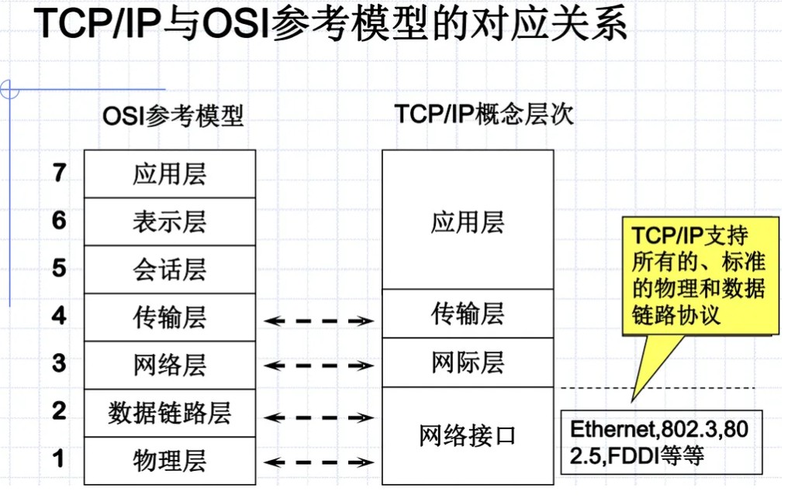

# 01-Introduction

> 计算机网络：C&C Computer & Communication

## 发展

1. 60年代：面向终端分布的计算机系统

2. 70年代：存贮转发-分组交换思想

   它将用户通信的数据划分成多个更小的等长数据段，在每个数据段的前面加上必要的控制信息作为数据段的首部，每个带有首部的数据段就构成了一个分组。首部指明了该分组发送的地址，当交换机收到分组之后，将根据首部中的地址信息将分组转发到目的地

3. 80年代：LAN

   开放系统互连基本参考模型OSI（Open System Interconnection Basic Reference Model）

4. 90年代至今：高速以太网,三层交换、ATM、VLAN、光纤技术发展

## 概述

### 定义

网络就是一些如工作站、人个人计算机、打印机、终端机等的节点通过硬件的相互实际联机连接，达到数据、影音等的传输通讯，并完成彼此间的软硬件资源共享目的的结构

### 分类

- 地域：

  局域网LAN，城域网MAN，广域网WAN

- 拓扑结构：

  星形，树形，回路形…

  总线型，环形，卫星或无线广播

- 信息传输交换方式

  电路交换、分组交换

- 网络组件属性

  公用网、专用网

### 解决问题

> 面临的问题： 数据传输、高可生存性、不同类型计算机、冗余性、简单 通讯本身：寻址，编码，差错控制 互联：不同硬件、不同软件

网络体系结构解决异质性问题采用的是分层方法。——把复杂的网络互联问题划分为若干个较小的、单一的问题，在不同层上予以解决。

> 对等层次之间的通信：逐层封装，物理层真实传输，逐层解封 协议要规定的内容：封装的头要怎么写，数据的格式

层次结构包括三个内容：

- 分层及每层功能
- 服务与层次接口
- 协议

网络协议三要素：

- 语义：需要发出什么控制信息，完成什么动作以及响应
- 语法：数据与控制信息的结构/格式
- 时序：事件实现顺序说明

### 体系结构

**ISO/OSI参考模型**

**对等通信：**

Service user; Service provider

对等层实体之间虚拟通信，下层向上层提供服务，实际通信在最底层完成

**协议数据单元（Protocol Data Unit）:**

为了提供服务，下层把上层的PDU作为本层的数据封装，然后加入本层的头部（和尾部）。头部中含有完成数据传输所需的控制信息。

数据自上而下递交的过程就是封装的过程。

某一层只能识别由对等层封装的“信封”，而对于被封装在“信封”内部的数据仅仅是拆封后将其提交给上层，本层不作任何处理。

**OSI各层功能概述：**

1. 物理层 Phisical

   实现物理媒体上透明的传送原始比特流

   eg.数据终端设备DTE（计算机、路由器），数据通信设备DCE（MODEM）

   > 向上层提供比特流 怎么发01串，使用什么信号，怎么解释…

2. 数据链路层 Data Link

   在物理线路上提供**可靠的数据传输**，使之对网络层呈现为一条无错的线路

   > 物理层出现了差错，这里提供的是可靠的比特流 eg.校验位 组装帧：把数据组装成帧的方式上交网络层

   广播式信道问题：

   共享信道的访问

   > 链路层也关心信道的设计 逻辑链路控制Logical Link Control，介质访问控制Media Access Control

3. 网络层 Network

   > 为分组交换的不同主机之间提供通信服务： 两个任务：
   >
   > 1. 通过算法，在每个路由器上生成一个转发表
   > 2. 当路由接收到一个分组的时候，按照转发表把分组转给下一个路由器，实现不同主机的通信

   在源端与目的端之间建立、维护、终止网络的连接

   路由选择：

   如何寻找最佳路径

   距离向量算法：RIP, CGP

   链路状态算法：OSPF

   ------

4. 传输层 Transport

   1. 为上层提供可靠的数据通信
   2. “通用的”，位于资源子网和通信子网交界处，实现“端到端”

5. 会话层 Session

   建立、管理或者中止不同机器上的应用程序之间的会话

   会话：信息交换

   同步：检查点

6. 表示层 Presentation

   处理被传送数据的表示，数据的解释或者压缩

7. 应用层 Application

   有很多协议，定义应用进程间的交互规则 这里的数据单元叫做报文

**TCP/IP协议集**

TCP/IP协议的封装：

4个层次概念：

1. 应用层

2. 传输层

   流量控制，可靠传输

   TCP(Transmission Control Protocol)：面向连接的，可靠的，传报文段（电话）

   UDP(User Datagram Protocol)：无连接的，不可靠的，传用户数据报（短信）

3. 网际层

   PDU叫数据报

   四个主要协议：IP, ICMP, ARP, RARP

   子网  IP地址

4. 网络接口

