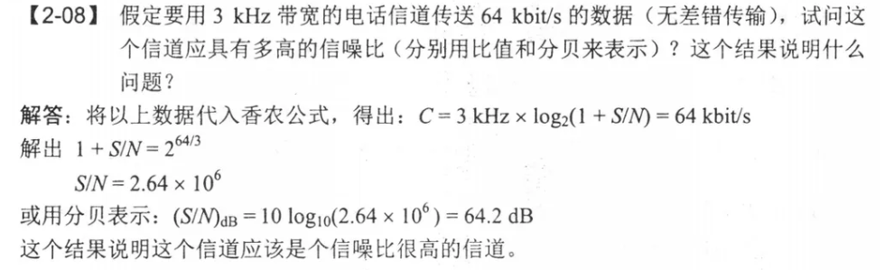

# 02-Question

1. 物理层要解决哪些问题？

   任务是透明的传输比特流，发送方发送1或0时，接收方应该收到对的数，物理层就要考虑用多大的电压代表1和0，接收方如何识别发送方发送的比特。

2. 双工通信

   单工：单向通信

   半双工：双向交替通信

   全双工：双向同时通信

3. 码元和比特有什么区别？

   一个码元可能对应多个比特，或者几个码元对应一个比特

   看需要用几个比特来代表一个信号

4. 一个经典香农定理计算题：

   

   用的公式：C=Wlog2(1+S/N)

   C的单位是bits/s，W的单位是Hz，S/N正常算出来的不是dB单位的，如果需要还要再转一下

5. 信道复用技术：共同使用共享信道。频分复用、时分复用、波分复用、码分复用