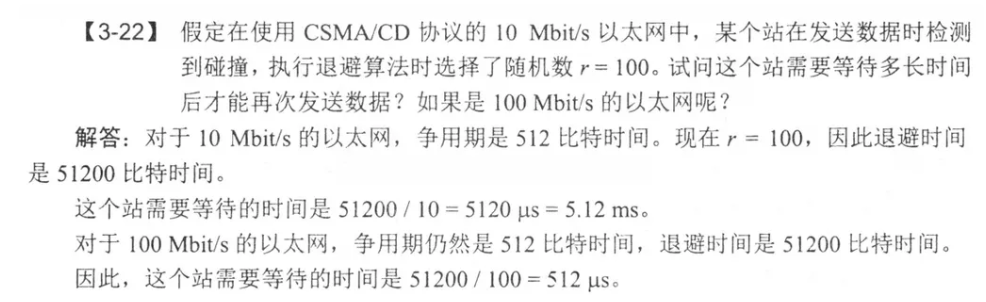
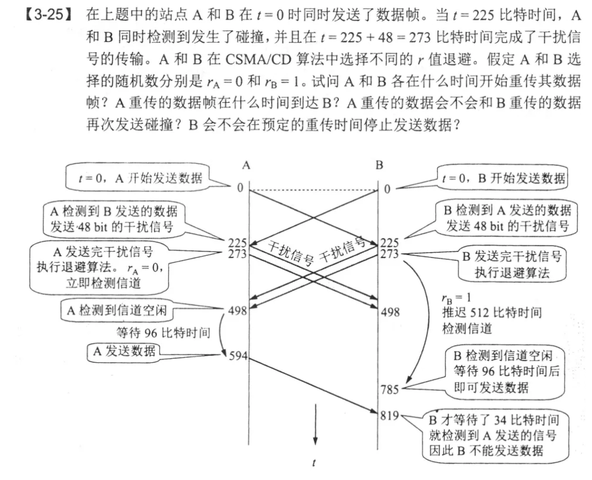
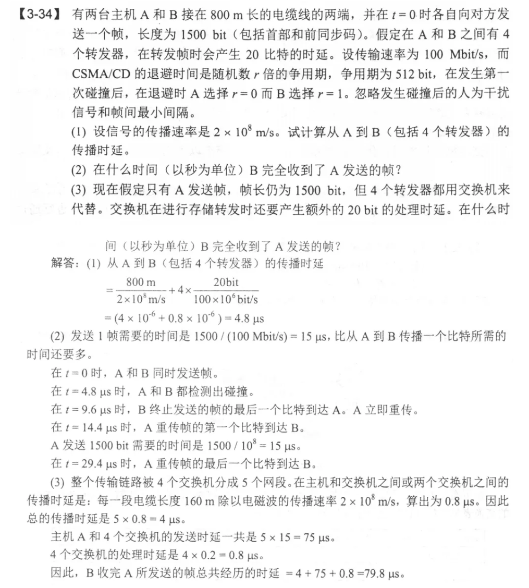

# 03-Question

1. 数据链路层的功能（3个）

   封装成帧、透明传输、差错检测

   - 封装成帧：首尾加上必要的控制信息，接收端收到之后可以根据首尾部识别开始和结束
   - 透明传输：上层交下来的数据不管什么形式比特组合，都必须能够正确传送
   - 差错检测：在传递的中间节点处可以检错，请求重传

2. PPP协议

   接收方每收到一个帧，进行CRC检验，通过留下，不通过直接丢弃

   不使用帧的编号，因为不需要重传，没有可靠传输

3. 局域网

   局域网：网络为一个单位所拥有，地理范围和站点数目都有限，采用广播通信；广域网广播通信资源浪费，不用广播

4. 以太网：10Mbit/s，曼彻斯特编码会让一个码元变成两个

5. 比特时间：发送1比特需要的时间

   

   这个512比特时间是怎么算的：以太网争用期是51.2微秒，51.2微妙内可以发送512bit数据，所以争用期也是512比特时间

   在10Mbit/s的以太网上，100比特时间=10微秒

6. 如果传输的是以太网的最小帧长512bit，同时带着的还有8字节(64bit)的前同步码和帧开始定界符

7. CSMA/CD

   

   几个点：

   r值退避是指在检测到碰撞后等待夺少个争用期开始监测信道，所以在检测到碰撞之后就可以开始检测信道了，只不过在收到干扰信号之前，信道都不是空的；

   以太网最小帧间隔是9.6微秒，也就是96比特时间

8. 以太网交换机有什么特点？

   工作在数据链路层，每个接口都可以直接全双工通信，每个人都可以独立使用带宽

9. 有意思的题

   

   （1）求传播时延的很好求

   （2）在检测到碰撞之后，A其实不可以直接发东西，因为在碰撞发生之前B一直在传输数据，信道不是空闲的，得等B在这段时间之内传输的数据都到了才可以进行重传；同时注意如果是求接收方的最后，两边查了一个传播时延

   （3）交换机的存储转发：是要占帧的发送时间的

10. 网桥：在数据链路层，根据MAC帧的目的地址对收到的帧进行转发和过滤