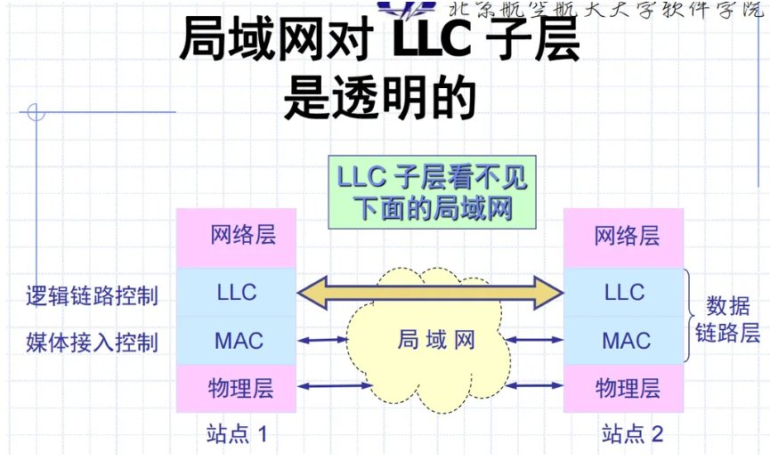
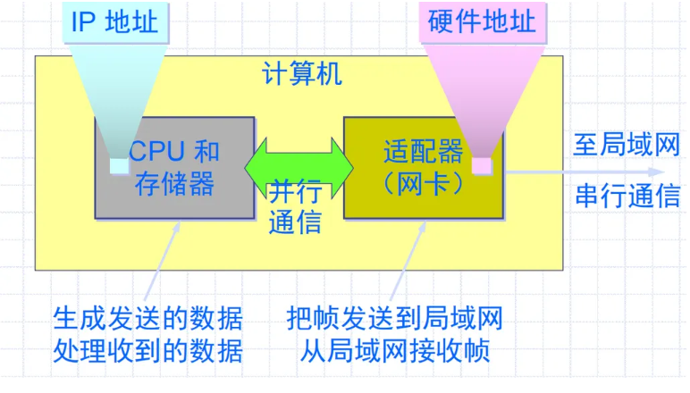
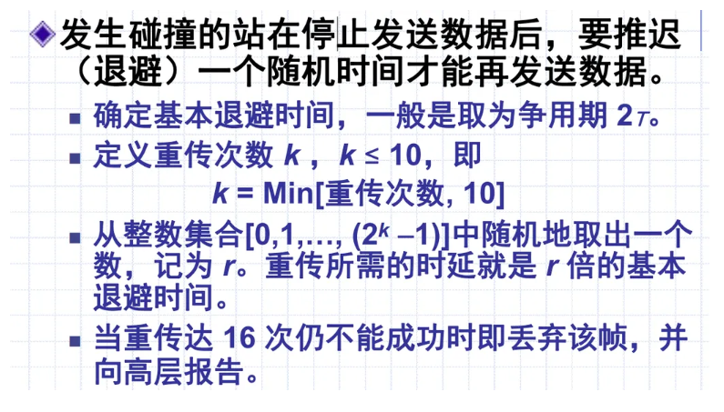
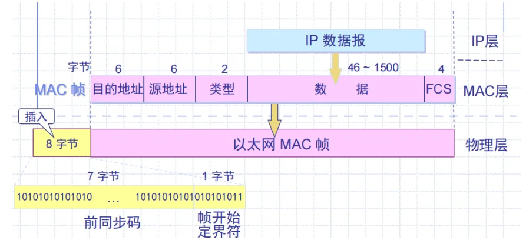
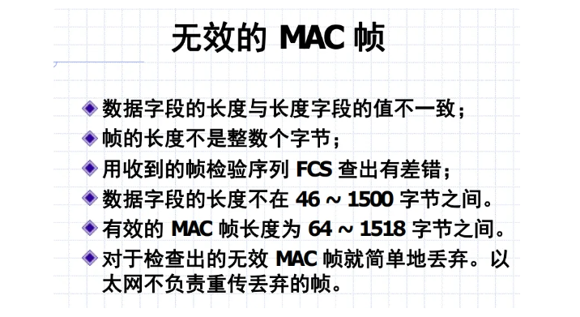
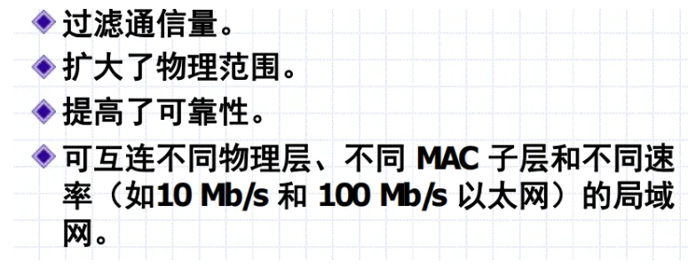
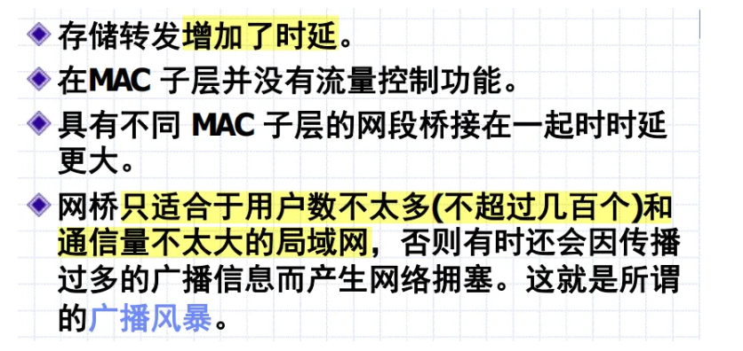

# 04-LAN

# 局域网概述

## 历史与发展

**影响局域网性能的因素**

- 传输介质：双绞线、同轴电缆、光纤
- 网络拓扑：星形、环形、总线型
- MAC协议（规定各个站点怎么利用共享的信道，什么条件下站点可以发信）
- 交换式还是共享式：交换机VS集线器

**局域网特点**

- 覆盖范围有限
- 数据率较高
- 误码率较低
- 支持组播广播

网络为一个单位所有，地理单位和站点数目有限

优点：

- 广播功能，一个站点访问全网
- 系统拓展

## 局域网拓扑

星形：一根断了不会影响整个网络

环形：计算机容易协调；一根断了整个都失效

总线：不限比星形少，但是总线断了网络就失效

### 数据链路层的两个子层

MAC(媒体接入控制)子层负责物理层上的无差别通信：

- 把数据封装成帧
- 实现和维护MAC协议
- 比特差错检测
- 寻址

LLC(逻辑链路控制)子层负责数据链路层中与媒体无关的部分

- 建立和释放逻辑链接
- 提供同高层的接口
- 差错控制
- 给帧加序号

与接入到传输媒体有关的内容都放在 MAC子层，而 LLC 子层则与传输媒体无关，不管采用何种协议的局域网对 LLC 子层来说都是透明的

### 适配器（网卡）的作用

“网卡”

主要功能：

- 进行串行/并行转换
- 对数据进行缓存
- 在计算机的操作系统安装设备驱动程序
- 实现以太网协议

**计算机通过适配器和局域网通信**

# 以太网技术

1. 使用共享的公共传输通道
2. 载波监听，多路访问

## 总线结构

以太网的广播方式发送，总线上只有地址与数据帧首部一致的才接收，其他的丢弃

为了通信方便的两种措施：

1. 采用无连接的工作方式，即不必先建立连接就可以直接发送数据
2. 以太网对发送的数据帧不进行编号，也不要求对方发回确认

以太网提供的服务：

- **不可靠的交付**
- 有差错的数据帧就丢弃，差错纠正高层来做
- 以太网不知道帧是不是重传的

使用曼彻斯特编码（电平变化，向上跳1，向下跳0）

## CSMA/CD算法

Carrier Sense Multiple Access With Collision Detection

载波监听多点接入/碰撞检测

多点接入：许多计算机以多点接入的方式连接在一根总线上

载波监听：每一个站在发送数据之前先要检测一下总线上是否有其他计算机在发送数据，如果有，则暂时不要发送数据

碰撞检测：计算机边发送数据边检测信道上的信号电压大小

### CSMA冲突域

A要发给B，传播时延为Prop，**最小帧长=2\*Prop\*传输速率**

这样能保证，在传播的过程中监测冲突，如果最小帧长内没有冲突，整个就不会有冲突了

### 重要特性

- 使用CSMA/CD协议的不能全双工通信，只能半双工（双向交替）
- 发送的不确定性使整个以太网的平均通信量远小于以太网的最高数据率

### 争用期

2*PROP→争用期/碰撞窗口

以太网取51.2us作为争用期的长度，对于10Mb/s的以太网，发送64字节，如果发生冲突也是前64字节之内的

### 最短有效帧长

为64字节，凡是小于64字节的，都是因为冲突异常中止的无效帧

### CSMA等待时间算法（3种）

1. 不坚持CSMA：如果空闲就发送，忙就等随机事件再重复
2. 1-坚持CSMA：空闲就发送，忙就监听到空闲发送；如果冲突就等随机事件重复（1概率发送）
3. P-坚持CSMA：空闲以P的概率发送，以(1-P)的概率延迟一个时间单位（最大传播时延），忙就监听直到空闲然后重复，如果被延迟就重复（P概率发送）

### 二进制指数类型退避算法

## 连接方式-HUB & Switch

### 使用集线器的星形拓扑

以太网采用**星形拓扑**，在星形的中心则增加了一种可靠性非常高的设备集线器（HUB）

集线器的以太网在**逻辑上仍是一个总线网**，各工作站使用的还是CSMA/CD 协议，并共享逻辑上的总线

### MAC硬件地址

地址=站点的名字或者标识符

“MAC地址”实际上就是适配器地址或适配器标识符EUI-48：不重复

适配器从网络上每收到一个 MAC 帧就首先用硬件检查 MAC 帧中的 MAC 地址，如果是发往本站的就收，不是就丢

发往本站：unicast, broadcast, multicast

### MAC帧的格式

以太网V2格式

46~1500：最小帧长 最小长度64-18首位=最小长度

类型字段：标志上一层使用的是什么协议，把收到的MAC帧的数据交给上一层的这个协议

在帧的 8 字节：第一个字段共 7 个字节，用来迅速实现 MAC 帧的比特同步；第二个字段是帧开始定界符，表示后面的信息就是MAC 帧

### 无效的MAC帧

### 网桥

工作在数据链路层，它根据 MAC 帧的目的地址对收到的帧进行转发

具有过滤帧的功能，不是向所有的接口转发此帧，而是先检查此帧的目的 MAC 地址，然后再确定将该帧转发到哪一个接口

**网桥使各网段成为隔离开的碰撞域**

优点：

缺点：

> 网桥 VS 集线器

集线器在转发帧时，不对传输媒体进行检测；

**网桥**在转发帧之前**必须执行 CSMA/CD** 算法

### Switch Hub 交换机

数据包只往指定的端口发送，每个端口就是一个冲突域

使用交换机能够划分冲突域，而不能划分广播域；划分广播域需要在上层（网络层）使用路由器进行

优点：

- 存储转发+CRC检验
- 改变HUB的直通式交换
- 能并发冲突区
- 不需要监听
- 距离拓展

### 冲突与广播

碰撞域、冲突域：一个碰撞域种，同一时刻只能有一个站点发送数据

广播域：同一个广播包能到达的所有设备

交换机可以划分冲突域，但是不能划分广播域

**集线器和交换机的区别**

1. OSI体系结构
   - 集线器属于物理层设备，交换机属于数据链路层设备
   - 集线器只是对数据的传输起到同步、放大和整形的作用，而交换机不但可以对数据的传输做到同步、放大和整形，而且可以过滤短帧、碎片等，从而保证数据传输的完整性和正确性
2. 工作方式
   - 集线器采用广播方式
   - 交换机只有源端口和目的端口可以收到，可以隔离冲突域
3. 带宽
   - 集线器所有端口共享一条带宽
   - 交换机每个端口独占一条带宽

# 其它局域网技术

## 令牌环网

重负载的时候也可以很好的工作

## FDDI

光线分布式数据接口

自恢复性