# 基本概念

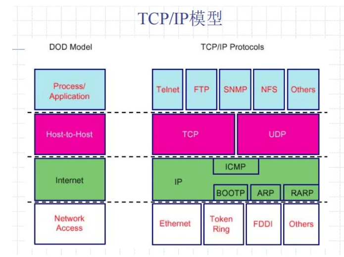

应用层，传输层，网络层，网络接口层

## 网络层

TCP/IP标准中正式定义的第一层

主要功能：**投递分组**

- 编址
- 寻址-路由

主要协议：

- 网际协议 IP
- 地址解析协议 ARP
- 网际控制报文协议 ICMP
- 网际组管理协议 IGMP

> 一些中间设备：
>
> 1. 物理层→转发器、集线器
> 2. 数据链路层→网桥、交换机
> 3. 网络层→路由器
> 4. 网络层以上→网关

### 网际协议 IP

数据单元：数据报

主要功能：

- 把数据报交给主机，**不负责数据交付的可靠性**

数据报报头：

- 标记数据报以及控制该数据报的管理方式
- IP报头格式及内容

### 地址解析协议 ARP

用于获得指定IP地址的目标主机的物理地址

主机发送带有目标主机的广播，有这个IP地址的目标主机应该响应

### 网际控制报文协议 ICMP

用于报告错误

包含在IP数据报内

eg. 源停止，目标不可访问

### 网际组管理协议 IGMP

提供带有多播组标识的路由，使整个网络都支持多播

TCP/IP数据发送：

> TCP/IP数据发送：
>
> - 广播：ALL
> - 多播：每个被交付的主机必须注册多播地址，才能收到指定多播地址的数据
> - 单播

包含在IP数据报内

## 网络层提供的两种服务

### 电信网

面向连接的通信方式（和电话一样）

建立虚电路

**虚电路**

逻辑上连接，所有分组都沿着这一条逻辑连接按照存储转发方式传输

### 因特网

无连接的、尽最大努力交付的数据报服务

分组不建立连接，独立发送，组间无关

如果主机（即端系统）中的进程之间的通信需要是可靠的，那么就由网络的主机中的运输层负责（包括差错处理、流量控制等）

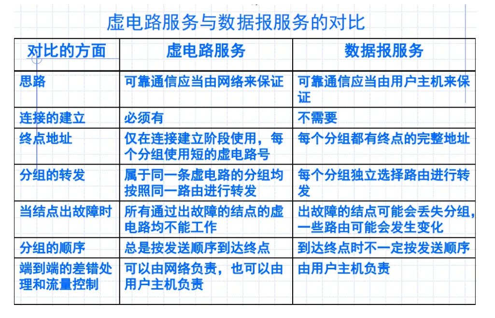

### 路由的作用

1. 转发源主机和目的主机之间所传送的数据
2. 传送路由信息

# IP协议基础

## IP数据报

无连接的分组转发服务→可靠的传输服务→应用服务

3个重要内容：

1. 基本的数据传送单元，为之指定了精确的数据格式
2. 如何实现路由功能，为数据发送选择路径
3. 包含一套规则描述主机和路由器应如何处理数据，出错数据应何时以及如何产生，丢弃分组的条件

### 虚拟互联网络

逻辑互连网络，利用 IP 协议就可以使这些性能各异的网络从用户看起来好像是一个统一的网络

### IP数据报结构

报头+数据域

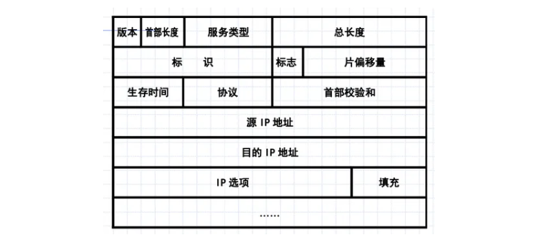

优先级

分片和组合：

IP数据报是由软件处理，与硬件无关，因而在不同版本的协议中可规定其最大长度

硬件处理的低层的数据帧长度是由硬件限定的，MTU

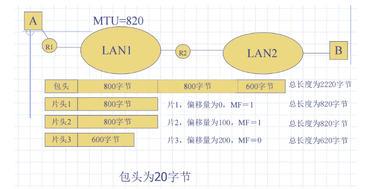

（**偏移量以8字节作为单位，MF=1表示还有分片，MF=0表示最后一片**）

数据报一旦被分片，则在到达目的主机之前就一直以单独的数据报存在，在到达主机后，才组合成原始的数据报

缺点：

- 都到接受端主机组合，效率不高
- 接受端主机会设置一个组合计时器，超时不组合

优点：

- 独立路由，负载均衡

标识符：用于分片的时候，识别属于哪一个数据报

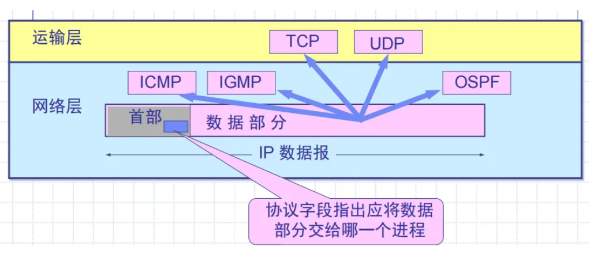

## IP地址

已经有物理地址（网卡地址，MAC地址）作为底层通信地址，为什么需要IP地址？

- 物理地址只在两个设备在同一物理网络中时才使用，IP地址提供了对远程网络中的设备进行寻址和访问的方法，它使得网关能容易决定数据报是留在本地网还是传输到其它网络
- 并非所有的网络主机都有网卡，拨号上网的主机无需网卡，利用IP地址可使拨号主机连接上IP网络
- IP地址可使得地址逻辑上有序
- **IP地址实际上是一种组织网络的方式，与物理地址的作用(区别不同的硬件设备)完全无关**

### IPv4

32位，两部分：网络ID+主机ID

不同类别的IP地址网络号n不一样

常用三种类别的IP地址：

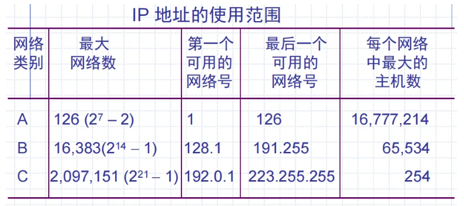

### 一些重要特点

1. IP 地址是一种分等级的地址结构
   1. 在分配IP地址时只分配网络号，而剩下的主机号则由得到该网络号的单位自行分配
   2. 路由器仅根据目的主机所连接的网络号来转发分组，可以减少路由表的存储空间
2. 实际上 IP 地址是标志一个主机（或路由器）和一条链路的接口
   1. 多归属主机：一个主机连接两个网络，要有两个IP地址
   2. 一个路由器至少连接两个网络，才能转发，所以至少两个不同的IP地址

### 特殊的IP地址

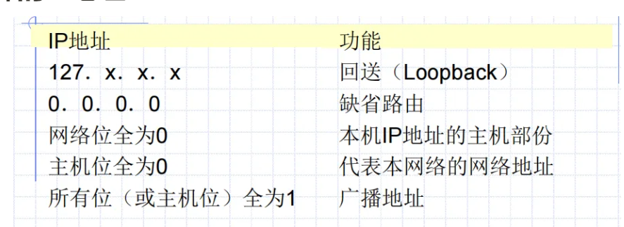

连入Internet要申请公用的IP地址

三个区域的私有地址

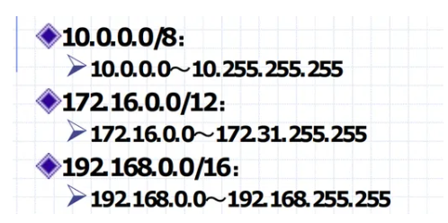

- 保留地址的网络内部通信，不能和其他网络互联（大家都有这个IP地址）
- 保留地址可以通过**NAT**方式把保留地址翻译为公共地址，实现与外部网络的互联

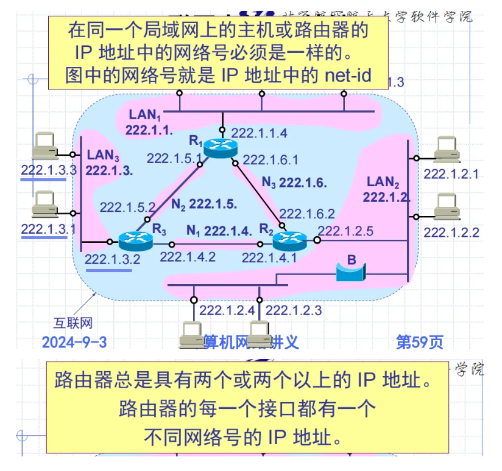

### IP与硬件地址

在具体的物理网络的链路层只能看见 MAC 帧而看不见 IP 数据报

### 网络掩码

网络掩码：格式同IP地址（四个字节、每个字节间以点分隔），网络位设置为1、主机位设置为0。网络掩码与IP地址进行与运算可获得网络位进址

就是指取分组的号

### 网路地址规划

子网划分：将主机位的前n位（子网数 = 2^n – 2）

解决问题：解决IP资源不足（网络数不足）或重新定向网络数据流和减少网络的拥挤程度

### 子网划分

子网掩码：指定网络ID和主机ID的分界

网络地址位为1，主机地址位为0

子网ID为全0或全1是不可以的，有可能会混

在两个主机进行通信时，IP可以通过子网掩码来断定源主机与目标主机是否处于同一个子网，从而决定是否要转给路由器

## 无分类编址CIDR

变长子网掩码 VLSM解决IP地址要用完了的问题

CIDR没有ABC类和子网的概念，使用各种长度的“网络前缀”代替网络号和子网号

“斜线记法”：IP地址后加上网络前缀占的位数

eg.

`128.14.32.0/20` 表示的地址块共有 2^12 个地址（因为斜线后面的 20 是网络前缀的位数，所以这个地址的主机号是 12 位）

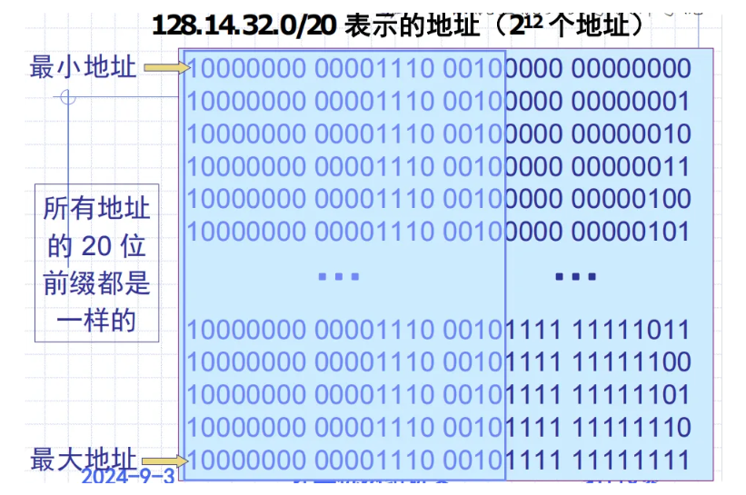

同一个局域网的主机或路由器的IP地址网络前缀是一样的，有一样的网络号

### 路由聚合

一个CIDR地址块可以表示很多地址，这种地址聚合成为路由聚合

路由聚合也称为**构成超网**

### 其它记法

10.0.0.0/10 可简写为 10/10，对应掩码：255.192.0.0

00001010 00*，在星号 * 之前是网络前缀，而星号 * 表示 IP 地址中的主机号

### 最长匹配

在查路由表的时候算最长匹配

# 其他协议

## ARP&RARP

Address Resolution Protocol地址解析协议

网络通讯的地址使用机制： 高层—逻辑地址（IP地址） 低层—物理地址（MAC地址） 数据传输时实际上是采用物理地址

ARP和RARP实现的是逻辑-物理地址的转换

ARP： IP地址 → 物理地址 RARP：物理地址→ IP地址

RARP服务器有物理地址-IP地址的对应表，可以查表

ARP cache，存了本局域网上一些IP到MAC地址映射表

ARP请求时广播，ARP响应是单播

## ICMP

是**IP层的协议**

允许主机或路由器报告差错情况和异常情况，报文作为IP层数据报的数据

有两种报文格式：ICMP 差错报告报文和 ICMP 询问报文

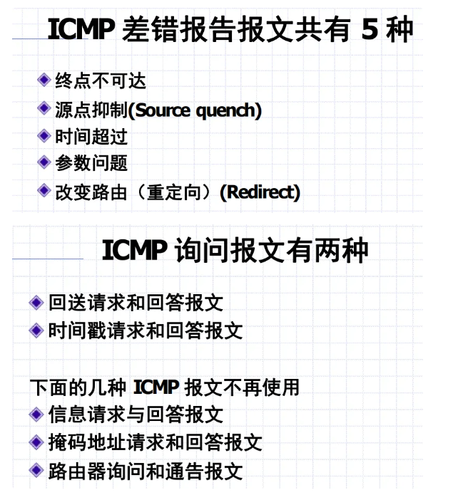

PING是应用层直接使用网络层的ICMP，不用TCP/UDP协议