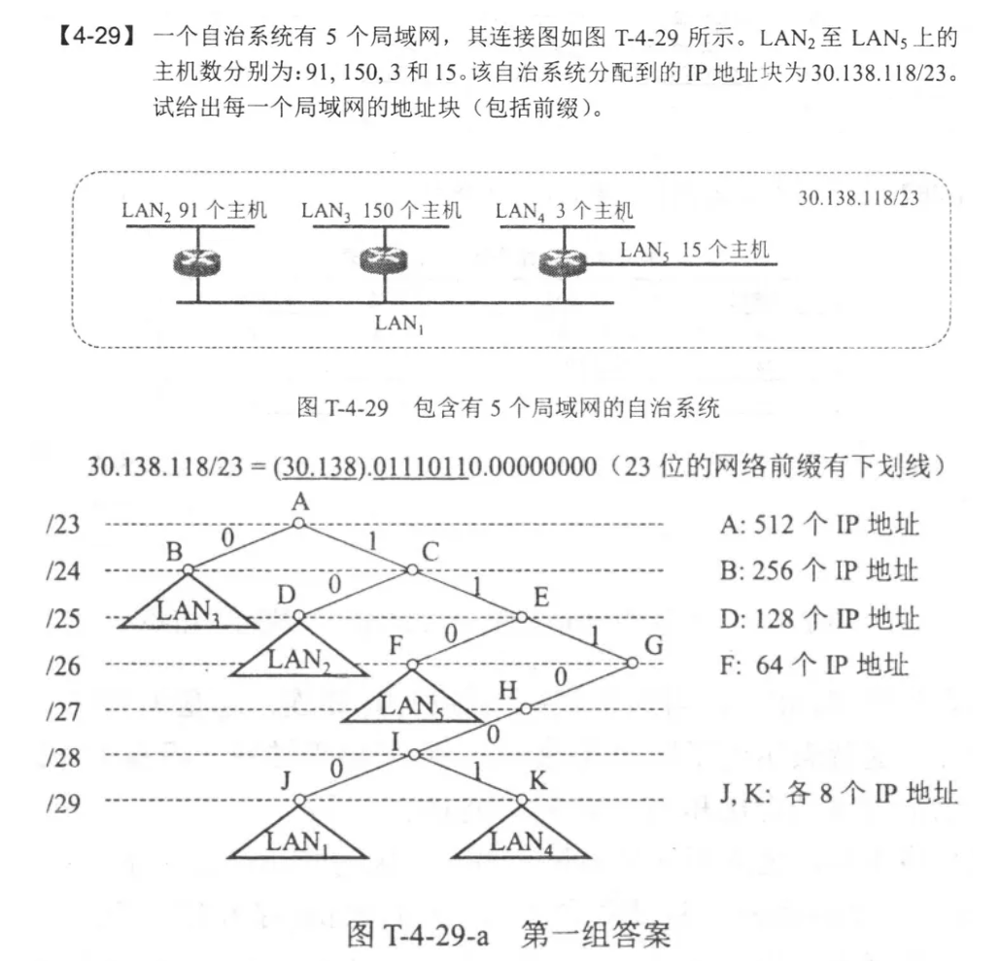

1. 解释一下IP, ARP, RARP, ICMP协议

   网际协议IP：虚拟互联网络，

2. ABC类网络

   A类网络：0，8位网络号（1+7）

   B类网络：10，14位网络号（2+14）

   C类网络：110，21位网络号（3+21）

3. IP数据报中的首部检验和并不检验数据报；当某个路由器发现首部检验和出错时，会直接丢弃，而不是要求源站重传。

   不检验数据可以加快分组转发的过程，IP首部中的源地址也可能是错的，所以重传是没有意义的，也不使用CRC校验，只有交到运输层之后才会去检验有没有出错。

4. ARP属于网络层不属于数据链路层，因为数据链路层使用MAC地址而不是IP地址

5. 列举不需要ARP请求分组的情况：

   源主机ARP cache中已经有该目的IP地址的项目；源主机发送的是广播分组；源主机和目的主机使用点对点链路

6. 途径5个路由器，使用6次ARP

7. IP层查找路由算法

   1. 从数据报首部提取目的IP地址
   2. 判断是否为直接交付。对路由器直连的网络逐个检查，用子网掩码按位与，如果是就用ARP把IP地址转换成MAC地址，封装成帧发送出去
   3. 查路由表是否有直接匹配的
   4. 与路由表每一行子网掩码按位与，看有没有匹配的
   5. 发送到默认路由
   6. 报告错误

   如果是CIDR，要匹配最长前缀

8. 划分局域网地址：画树做

   先划分好每个LAN对应的是几位子网掩码，画树分，按照路径写子网掩码

   

9. IGP vs. EGP

   IGP：Internal Gateway Protocol内部网关协议，是一个自治系统内部使用的路由选择协议，例如RIP和OSPF

   EGP：External Gateway Protocol外部网关协议，当源主机和目的主机处于不同的自治系统中是，数据报传到系统边界是，需要用一种协议将路由选择信息传递到另一个自治系统中，这样的就是外部网关协议，例如BGP-4

10. RIP, OSPF, BGP

    RIP：基于距离向量的路由选择协议。特点是：

    1. 仅和相邻路由器交换信息，不相邻不交换
    2. 路由器交换的信息是当前的路由表（全部信息）
    3. 按固定时间间隔交换路由信息

    OSPF：分布式的链路状态协议

    1. 向本自治系统中所有路由器发送信息，洪泛法
    2. 发送的信息是本路由器相邻所有路由器的链路状态（本路由器与哪些路由器相邻，以及链路的代价）
    3. 只有链路状态发生变化时才使用洪泛法发送信息

    BGP：采用路径项链路由选择协议，用于不同自治系统的路由器之间交换路由信息

    1. BGP在自治系统之间交换“可达性”信息
    2. 自治系统之间路由选择需要考虑有关策略
    3. BGP只能尽力寻找一条能够到达目的网络且比较好的路由，而非最佳路由

11. RIP使用UDP，OSPF使用IP，BGP使用TCP，都是为什么

    RIP使用UDP：之和邻站交换信息，UDP开销小

    OSPF使用IP：可靠的洪泛法，灵活性好且开销小

    BGP使用TCP：提供可靠交付减少带宽消耗

    RIP使用不可靠的UDP，需要周期性的交换信息，BGP使用可靠的TCP，不需要这样

12. 路由表更新路由表：得到新的路由表，先把距离+1，再比较；如果原来没有的节点，直接加进来，原来重名的节点（下一跳相同），就更新，如果更近也更新，下一跳更新成当前节点。

13. NAT，NAPT的作用

    NAT是网络地址转换，NAPT是网络地址与端口号转换。

    NAT可以通过使用NAT路由器使专用网内部的用户和互联网连接，IP数据报传送到NAT路由器之后就转换成了全球IP地址。但是NAT路由器的通信必须由专用网内的主机发起，当NAT路由器只有一个全球IP地址时，专用网中最多只有一个主机可以连入互联网。

14. IPv6没有首部校验和：对首部的处理更简单，数据链路层已经把有差错的帧丢弃了，网络层省去这个步骤

15. IPv6只允许在源点进行分片