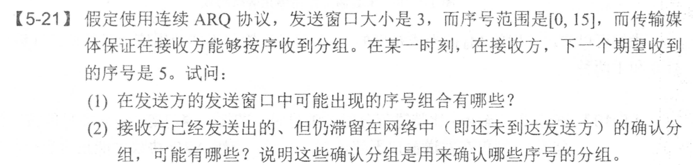
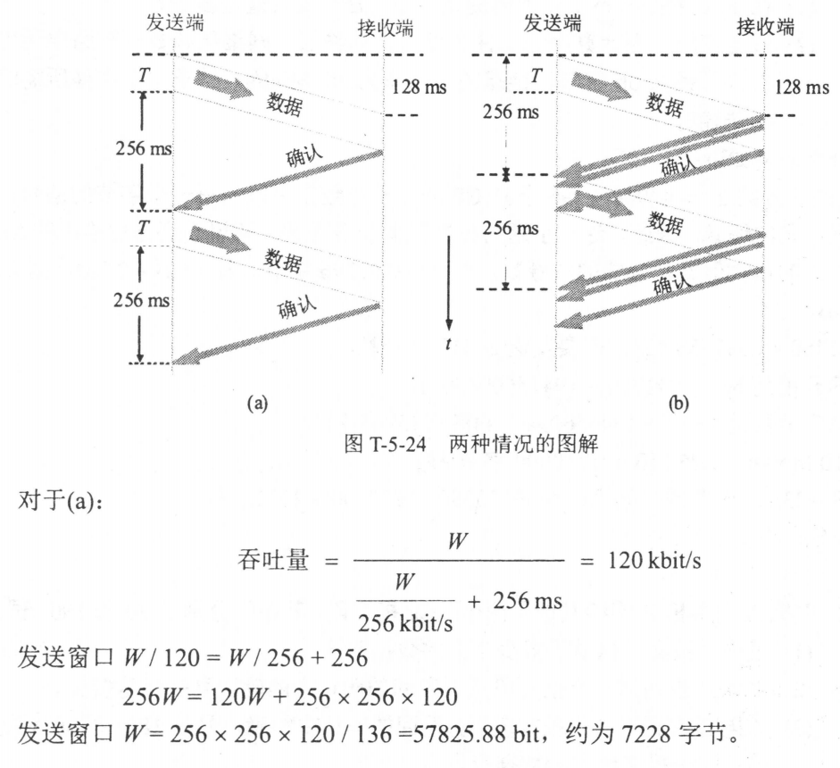
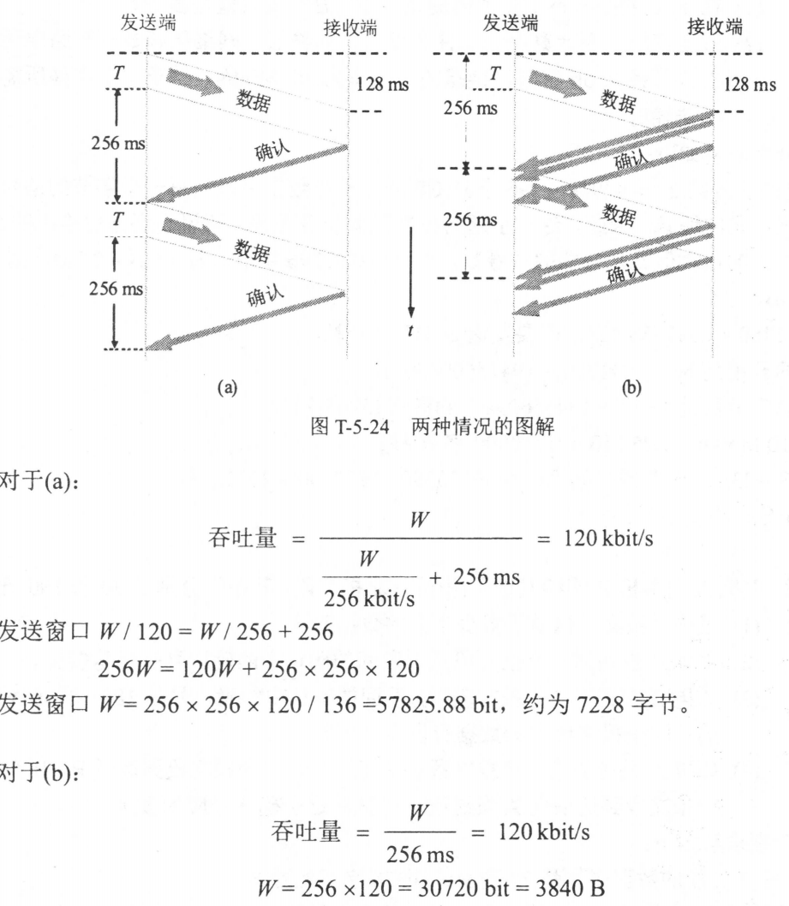
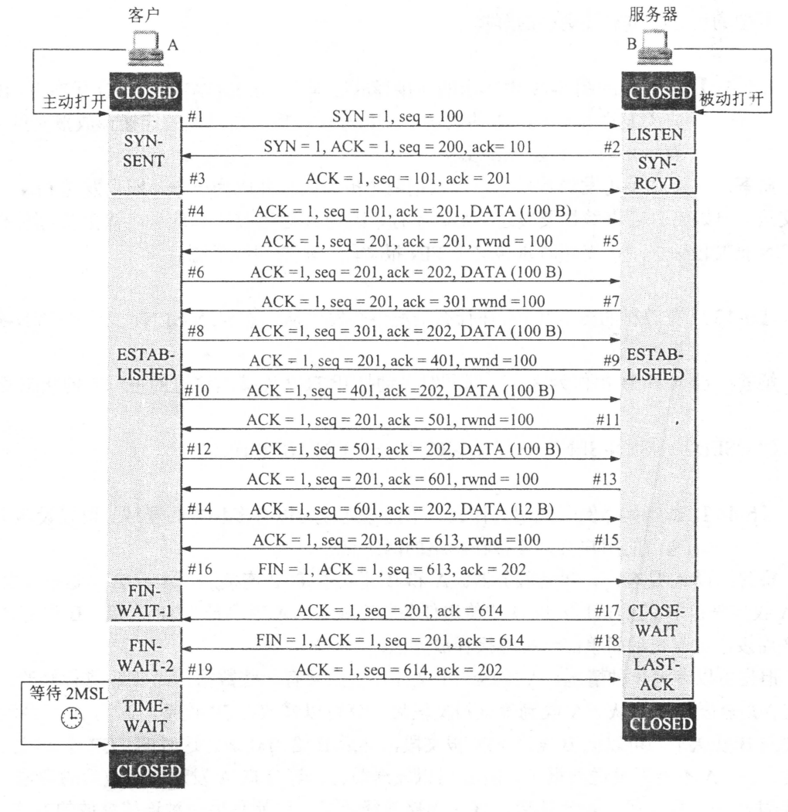

1. 接收方收到有差错的UDP，丢弃

Q. 为什么是UDP是面向报文的，TCP是面向字节流的？

A. 发送方的 UDP对应用程序交下来的报文，在添加首部后就向下交付IP层。UDP对应用层交下来的报文，既不合并，也不拆分，而是保留这些报文的边界。这就是说，应用层交给 UDP 多长的报文，UDP 就照样发送，即一次发送一个报文。在接收方的 UDP，对 IP层交上来的 UDP用户数据报，在去除首部后就原封不动地交付上层的应用进程，UDP一次交付一个完整的报文。因此，应用程序必须选择合适大小的报文。若报文太长，UDP把它交给IP层后，IP层在传送时可能要进行分片，这会降低IP层的效率。反之，若报文太短，UDP把它交给IP层后，会使IP数据报的首部的相对长度太大，这也降低了 IP层的效率。

Q. 伪首部是干什么的？

A. 用于计算检验和

Q. UDP提供了什么IP没有的功能？

A. IP只知道主机，不知道进程，UDP提供对应用进程的复用和分用，对数据部分的差错检验

Q. 停止等待协议，可不可以没有编号？

A. 不行，这样就不知道接收的是重传还是正常发送的

Q. 停止等待协议，收到重复的报文可不可以不理？

A. 不能，对于超时重传的报文，需要告诉收到了，不然会一直发

1. 对于一个UDP分片数据报，如果第一次丢了一部分，第二次丢了另一部分，这两次的结果是不能合在一起的，因为IP数据报会有标识符，只有标识符一样的才能组装

2. UDP首部长度：8字节

3. ARQ协议：

   

   （1）接收方希望收到5，说明4及之前的都收到了，对于发送方来说，4需要被发出去，所以1及以前的确认一定收到了，要不然发不出去4. 所以需要考虑的就是2，3，4的确认谁被收到了，有可能都被收到了，也有可能只有一部分，所以[2,4],[3,5],[4,6],[5,7]都有可能

   （2）考虑谁被收到了，2，3，4都有可能

4. TCP的MSS是1460字节，规定序号不重复，问文件长度最大值是多少：

   TCP是字节流，每个字节编号，所以和MSS没关系，序号最多32位，所以是4GB

5. TCP的两种确认机制：

   

   

   

   算吞吐量：发送字节/时间，注意单位

6. TCP传输，如果有确认报文丢失，也不一定就要重传：有可能收到了更前面的确认，表示这之前的一定都确认了

7. 一个TCP传输的例子：

   

   注意这里所有的回信都是不消耗序号的，只有第一次是消耗一个序号，其它全是一样的

8. 