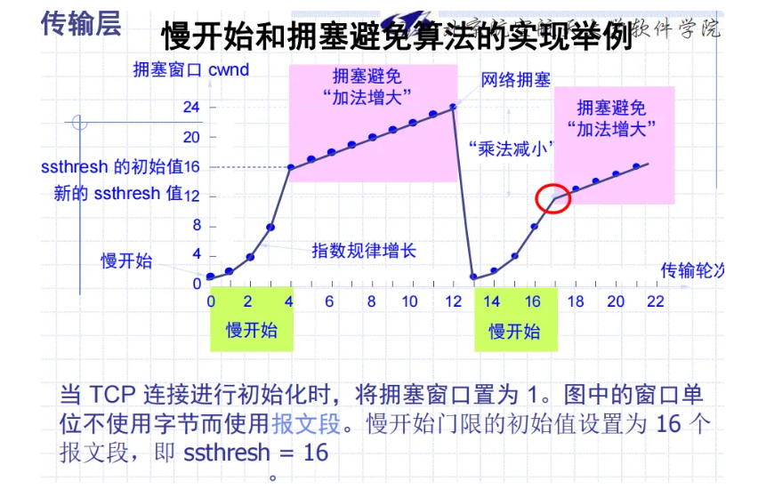

# 基本概念

- 两个不同系统的进程之间，端到端
- 进程到进程的可靠通信服务
- 多对进程通信复用到一条网络连接
- 传输层为应用进程之间提供逻辑通信，网络层为主机之间提供逻辑通信

### 传输层功能

连接管理

流量控制

差错控制

对用户请求响应

建立无连接和面向连接的通信

拥塞控制

传输层协议只应用在两个端系统中，不像网络层一样在路由上也有

### 解决的问题

不可靠的网络层服务；可靠的通讯需求

### 传输层协议

1. 可靠的，面向连接的，单播协议：TCP
2. 不可靠的，面向无连接的，单播、多播或广播：UDP

通过IP地址确定主机，通过端口确定进程

### 端口与连接

目的IP，目的端口，源IP，源端口，协议

五元组可以唯一标识一次传输层通信

组成一个套接字Socket

### TCP与UDP

都使用IP协议，**协议数据单元都作为IP数据报的数据**

UDP是无连接的，TCP提供面向连接的服务

# TCP协议

在不可靠网络中提供**可靠的、端对端的字节流通信**协议

### 特点

- 面向连接的
- 每一条TCP连接只能有两个端点，点对点的
- TCP提供可靠交付的服务
- 全双工通信
- 面向字节流

------

- 一条虚连接
- TCP对进程一次发送多长的报文不关心，根据对方给出的窗口值和当前网络拥塞成都决定一个报文多长（UDP是进程给出）
- TCP会把太长的数据块划分之后传送

### TCP的连接

- 连接是最基本的抽象，一条TCP有两个端点
- 连接的是**套接字**
- 端口号拼接IP地址构成套接字

### Socket

socket=（IP地址：端口号）

TCP连接={socket1，socket2}={（IP1：port1），（IP2，port2）}

## 报文格式

- 源端口和目的端口都是2字节，也就是4位

- 序号字段：4字节，TCP 连接中传送的数据流中的每一个字节都编上一个序号。序号字段的值则指的是本报文段所发送的数据的第一个字节的序号

- 确认号：4字节，期望收到对方的下一个报文段的数据的第一个字节的序号

- 数据偏移：TCP 报文段的数据起始处距离 TCP 报文段的起始处有多远

- 紧急 URG：=1标识紧急数据，尽快传送

- 确认 ACK：1有效

- 推送 PSH：=1的时候尽快交付应用进程，不用等到缓存都满了再向上交付

- 复位 RST：连接中出现严重差错，必须释放重连

- 同步 SYN：=1标识是一个连接请求或者连接接收报文

- 终止 FIN：发送完毕，释放连接

- MSS：TCP 报文段中的数据字段的最大长度，数据+首部=TCP报文段

- 伪首部：不真正传输，但是参与计算校验和

  把临时报文看作2字节为单位的字，算反码和，校验值是这个和的反码，校验的时候就是和为0

## 连接管理

### TCP连接建立

1. 通信双方都知道对方的存在
2. 协商通信参数
3. 分配运输实体资源

**三次握手**

TCP服务器进程先创建传输控制块TCB，时刻准备接受客户进程的连接请求，此时服务器就进入了 **LISTEN 监听状态**

**第一次握手** TCP客户进程也是先创建传输控制块TCB，然后向服务器发出连接请求报文，这是报文首部中的同步位SYN=1，同时选择一个初始序列号 seq=x ，此时，TCP客户端进程进入了 SYN-SENT 同步已发送状态

**第二次握手** TCP服务器收到请求报文后，如果同意连接，则会向客户端发出确认报文。确认报文中应该 ACK=1，SYN=1，确认号是ack=x+1，同时也要为自己初始化一个序列号 seq=y，此时，TCP服务器进程进入了 SYN-RCVD 同步收到状态

**第三次握手** TCP客户端收到确认后，还要向服务器给出确认。确认报文的ACK=1，ack=y+1，自己的序列号seq=x+1，此时，TCP连接建立，客户端进入ESTABLISHED已建立连接状态 触发三次握手

why？

**防止已经失效的连接请求报文突然又传送到了服务器，从而产生错误**

### TCP连接释放过程

**四次挥手**

**第一次挥手** 客户端发出连接释放报文，并且停止发送数据。释放数据报文首部，FIN=1，其序列号为seq=u（等于前面已经传送过来的数据的最后一个字节的序号加1），此时，客户端进入FIN-WAIT-1（终止等待1）状态

**第二次挥手** 服务器端接收到连接释放报文后，发出确认报文，ACK=1，ack=u+1，并且带上自己的序列号seq=v，此时，服务端就进入了CLOSE-WAIT 关闭等待状态

**第三次挥手** 客户端接收到服务器端的确认请求后，客户端就会进入FIN-WAIT-2（终止等待2）状态，等待服务器发送连接释放报文，服务器将最后的数据发送完毕后，就向客户端发送连接释放报文，服务器就进入了LAST-ACK（最后确认）状态，等待客户端的确认。

**第四次挥手** 客户端收到服务器的连接释放报文后，必须发出确认，ACK=1，ack=w+1，而自己的序列号是seq=u+1，此时，客户端就进入了TIME-WAIT（时间等待）状态，但此时TCP连接还未终止，必须要经过2MSL后（最长报文寿命），当客户端撤销相应的TCB后，客户端才会进入CLOSED关闭状态，服务器端接收到确认报文后，会立即进入CLOSED关闭状态，到这里TCP连接就断开了，四次挥手完成

### 流量控制

在发送完一个分组后，必须暂时保留已发送的分组的副本。 分组和确认分组都必须进行编号。 超时计时器的重传时间应当比数据在分组传输的平均往返时间更长一些。

**可靠通信的实现**

自动重传请求ARQ

**流水线传输**

一个报文时一个字节流，TCP面向字节传输，每个字节进行编号，以字节为单位的滑动窗口

发送窗口时发送+未确认的窗口

**发送缓存与接收缓存**

发送缓存：应用程序传送给发送方 TCP 准备发送的数据；TCP 已发送出但尚未收到确认的数据

接收缓存：按序到达的、但尚未被接收应用程序读取的数据；不按序到达的数据

TCP要求接收方必须有累计确认的功能

**超时重传**

### 拥塞避免

慢启动：一开始指数级，到达门限值之后加法增大；

到网络拥塞之后，减小到0，门限值变成拥塞窗口值的一半，注意是拥塞时的窗口大小，不是初始门限值的一半

发送窗口=min（通知窗口，拥塞窗口）

### 快重传

接收方每收到一个失序的报文段后就立即发出重复确认

连续收到三个重复确认立刻重传，不用等重传计时器到

### 快恢复

直接从拥塞窗口/2开始加法增大

# UDP协议

无连接、不可靠的

只是在IP基础上增加了端口号

UDP支持广播和多播

UDP常见应用：

- DNS：域名服务
- SNMP：简单网络管理协议
- RIP: 路由信息协议
- P2P:点对点通信

# NAT协议

把内网IP翻译成外部合法地址

TCP负载重分配：NAT由外向内的翻译