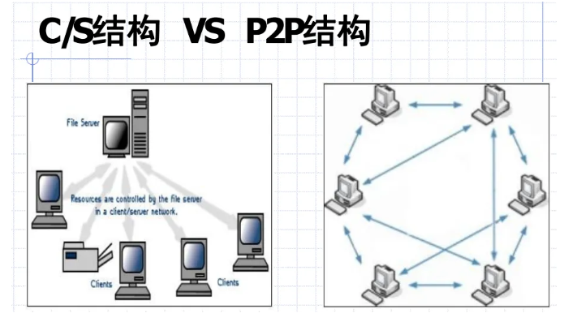
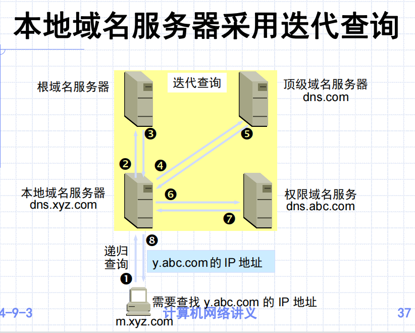
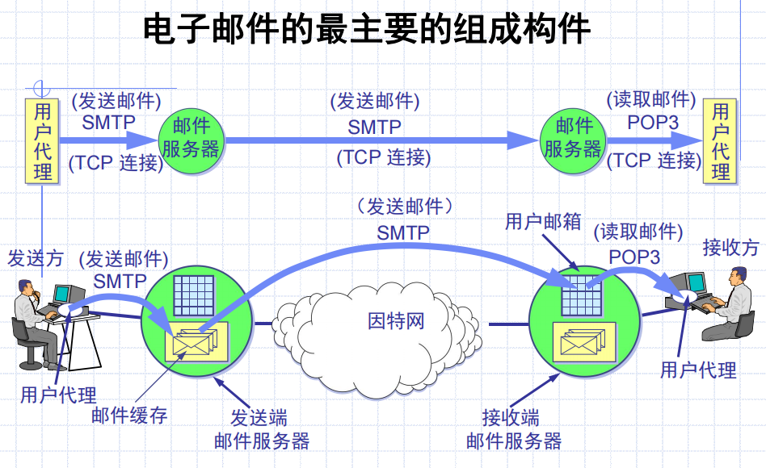
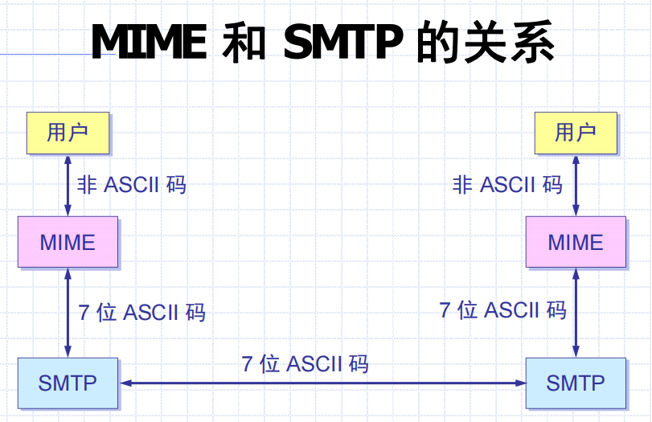
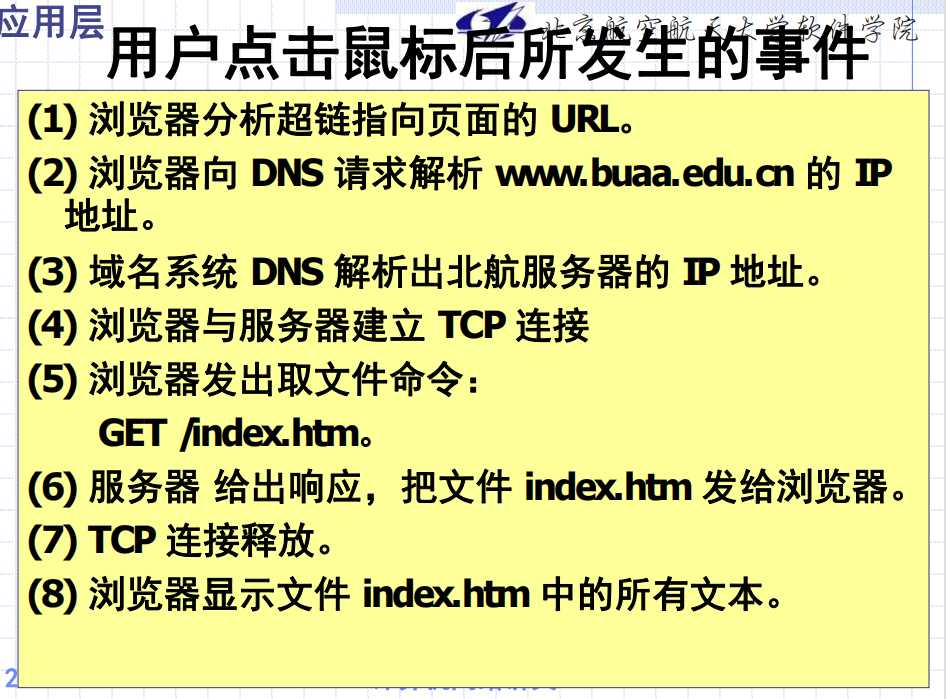

## 基本概念

运行在连网主机的用户空间

### Client-Server模型

两个进程

### P2P计算模型

分布式的极端

参与一次应用服务的进程往往是位于不同主机上的多个进程

## DNS域名服务

- 域名系统是一个典型的客户/服务器交互系统；
- 域名系统是一个多层次的、基于域的命名系统，并使用分布式数据库实现这种命名机制

域名解析：向本地域名服务器发请求，UDP格式发出去，域名服务器找到对应IP地址给响应；本地域名服务器没办法解析的时候，向自己的上级发，递归解析

### 域名服务器分类

1. 根域名服务器

   知道所有的顶级域名服务器的域名和 IP 地址

   本地域名服务器解析不了，先求助根域名服务器，告诉顶级域名服务器的IP地址

2. 顶级域名服务器

   管理二级域名

   DNS查询请求，有可能给结果，也有可能给下一步的域名服务器IP地址

3. 权限域名服务器

   负责一个区

4. 本地域名服务器

### 名字的高速缓存

每个域名服务器都维护一个高速缓存

每项有内容计时器

## SMTP&POP3协议

基于TCP，有三种：

- SMTP simple mail transfer protocol
- POP3 post office protocol 3
- IMAP internat message access protocal

MIME：通用因特网邮件扩充

SMTP：客户服务器工作

### 邮件首部

To：收件人

Subject：主题

Cc：抄送

From Date

### POP3

客户服务器

接收邮件的用户 PC 机中必须运行 POP 客户程序，而在用户所连接的 ISP的邮件服务器中则运行 POP服务器程序

### IMAP

客户服务器

IMAP 是一个联机协议

可以看首部，如果要开邮件才传回来

### MIME

SMTP 限于传送 7 位的 ASCII 码

## HTTP协议

### 万维网WWW

- 怎样标志分布在整个因特网上的万维网文档？

使用统一资源定位符 URL

<URL的访问方式>://<主机>:<端口>/<路径>

访问方式：FTP, HTTP, News

主机：存放资源的主机的域名

- 用何协议实现万维网上各种超链的链接？

HTTP 是一个应用层协议，它使用 **TCP** 连接进行可靠的传送

**HTTP 是面向事务的(transaction-oriented)应用层协议**

HTTP 1.0 协议是无状态的

**HTTP 协议本身也是无连接的**，虽然它使用了面向连接的 TCP 向上提供的服务

- 怎样使各种万维网文档都能在因特网上的各种计算机上显示出来

超文本标记语言 HTML